### 创建Web项目

#### 1、通过JavaEE创建（IDEA2022）

- web_demo_javaee

##### （1）使用Java Enterprise创建web项目，选择web application、tomcat、maven，直接next

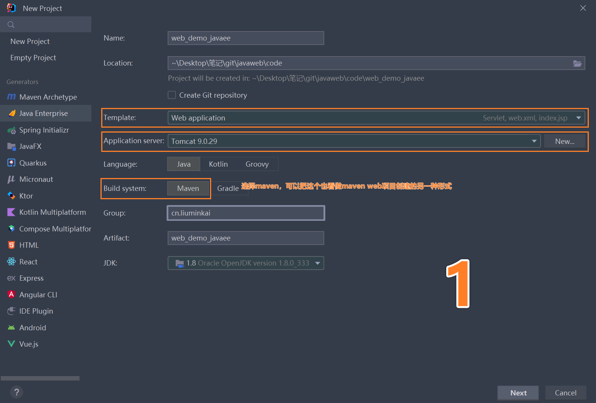

##### （2）选择版本，直接create，简单demo就创建成功了

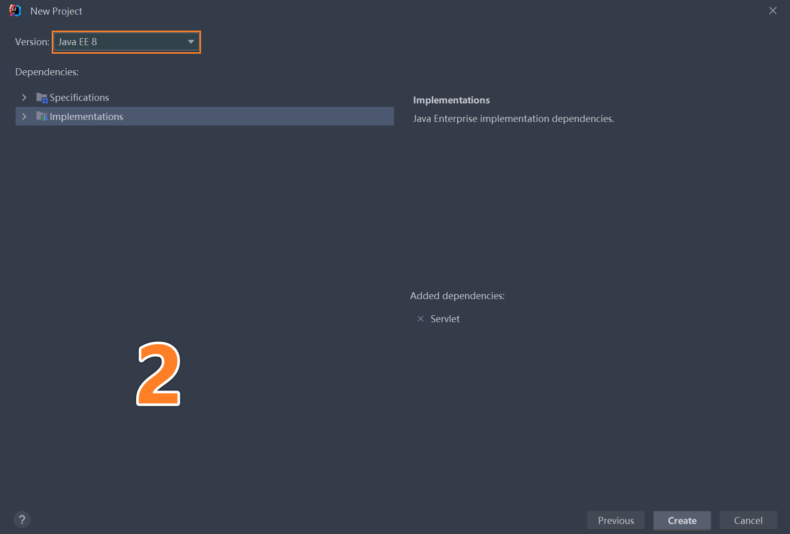

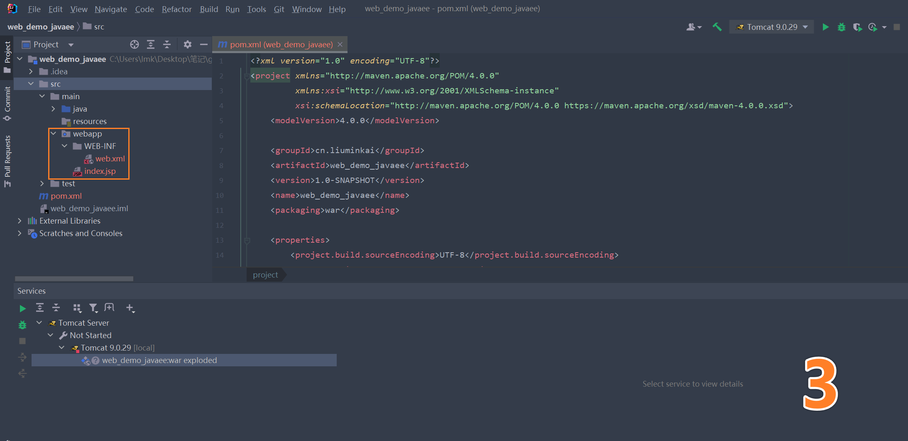

#### 2、通过Maven创建（IDEA2022）

- web_demo_mvn

##### （1）通过New Project 创建一个简单的maven项目，直接create

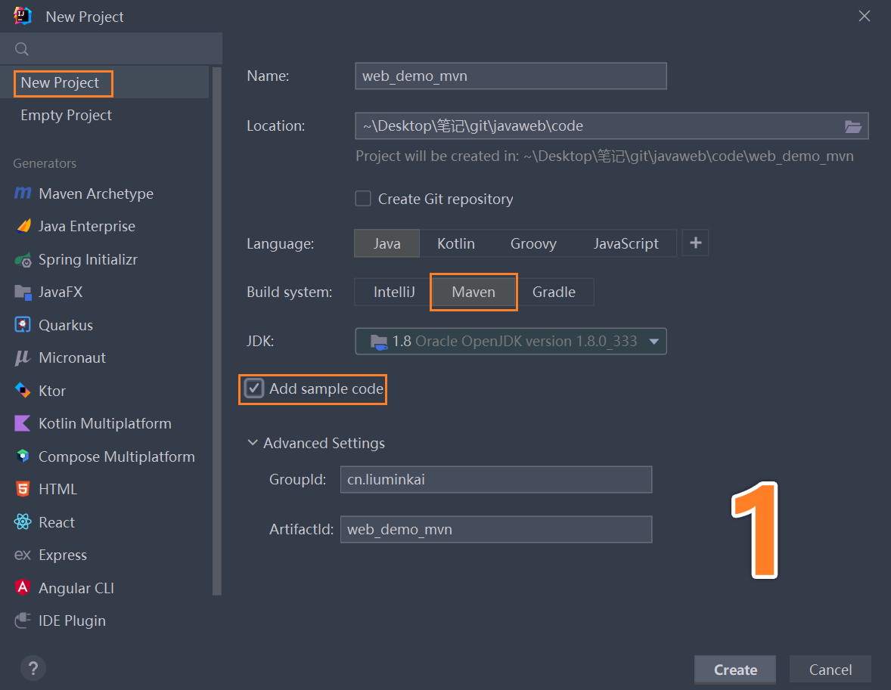

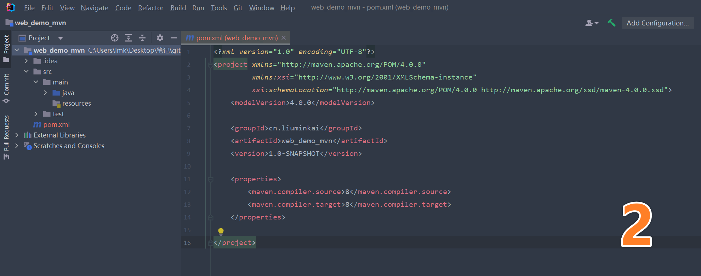

##### （2）普通 maven项目，添加web支持

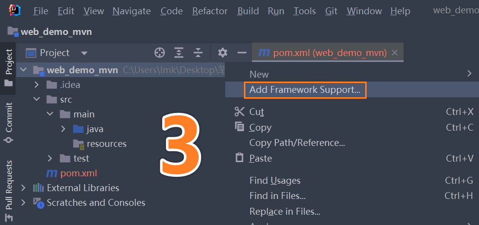

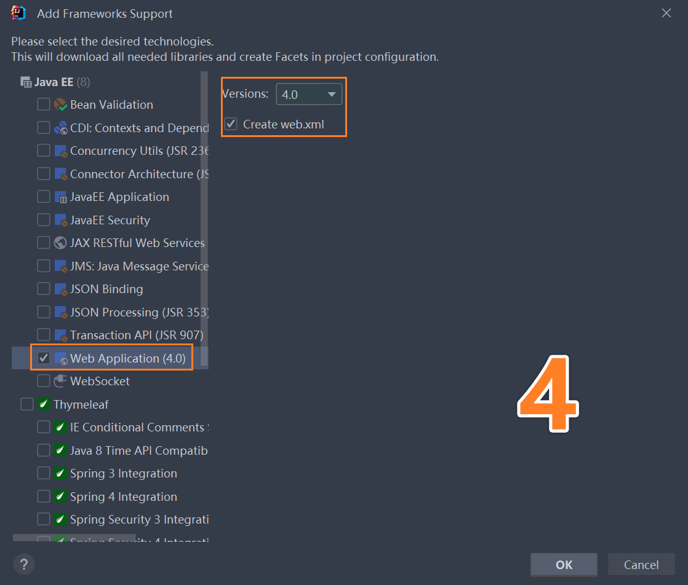

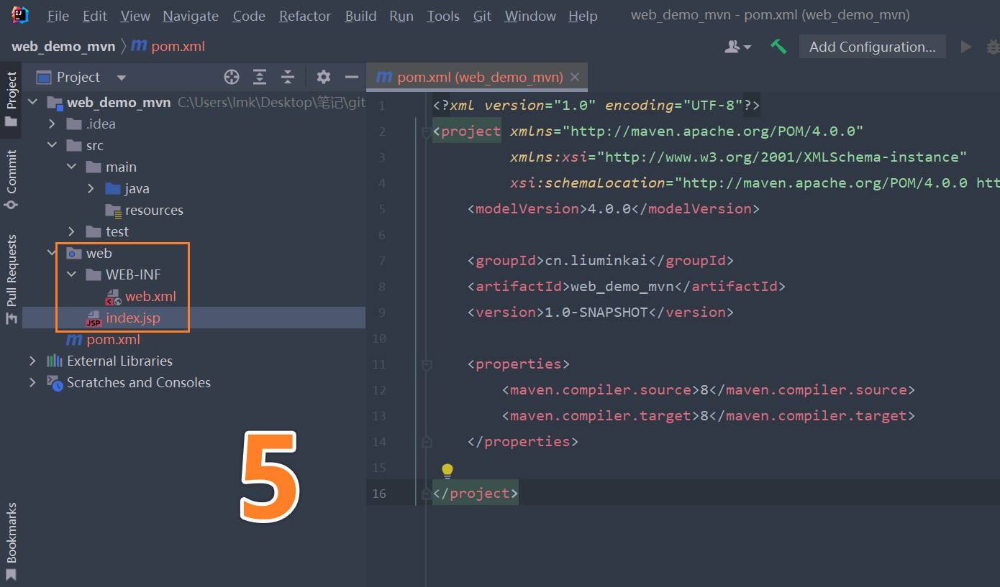

##### （3）IDEA整合tomcat

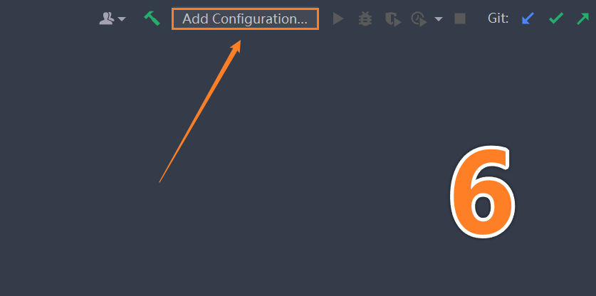

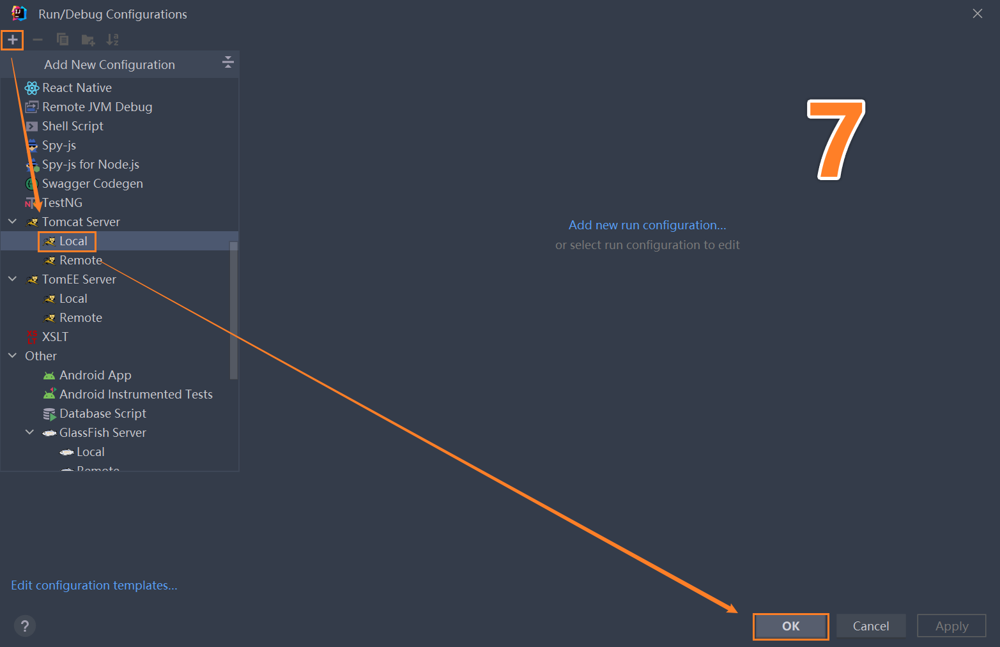

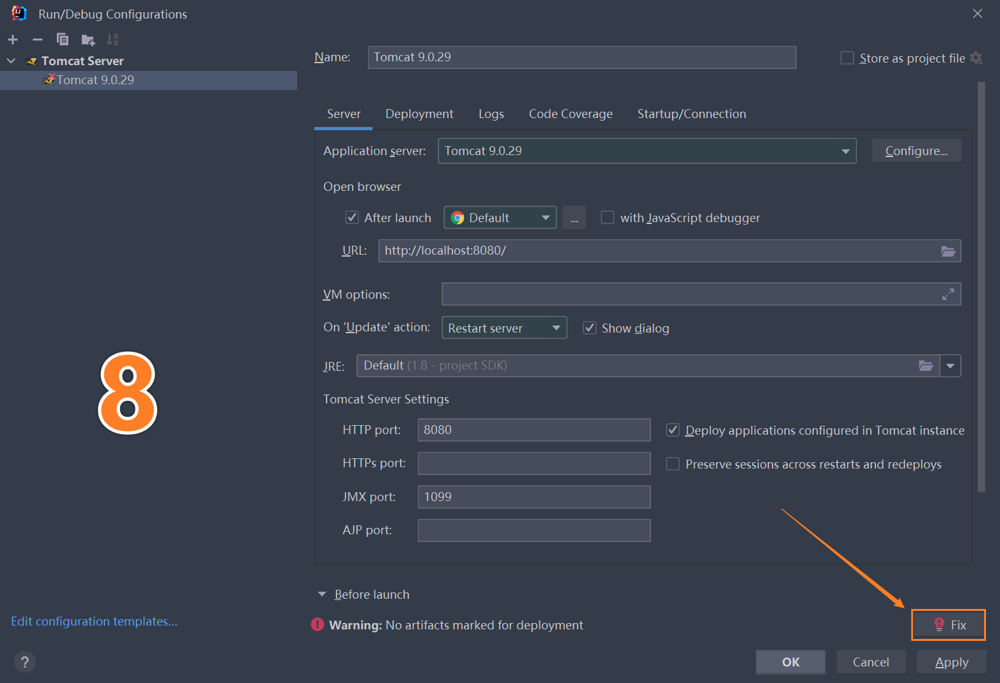

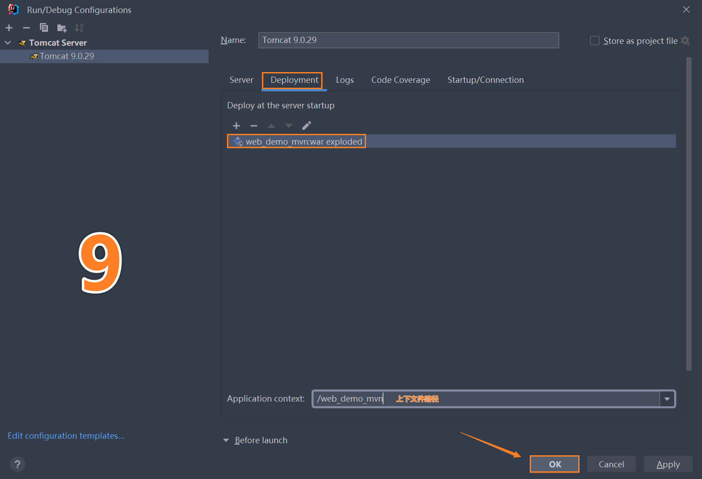

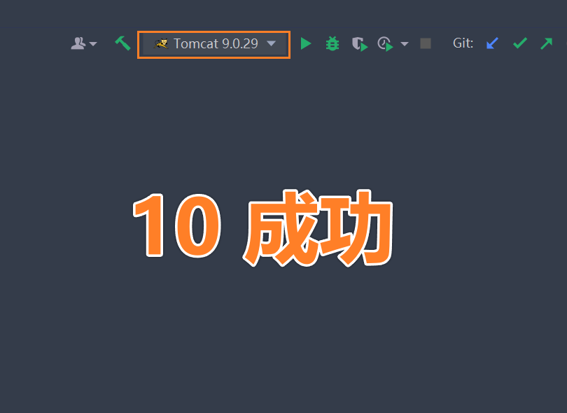