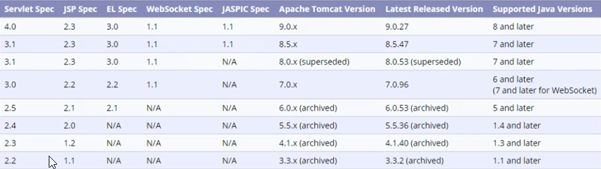

## JavaWeb安装软件集

### 1、Tomcat

#### 版本支持情况：

#### 下载地址：

从官网下载：https://tomcat.apache.org/

#### 安装步骤：

##### windows：解压压缩包即可

略

#### 启动问题

- 启动窗口一闪而过：没有配置jdk环境变量
- java.net.BindException：端口8080被占用
